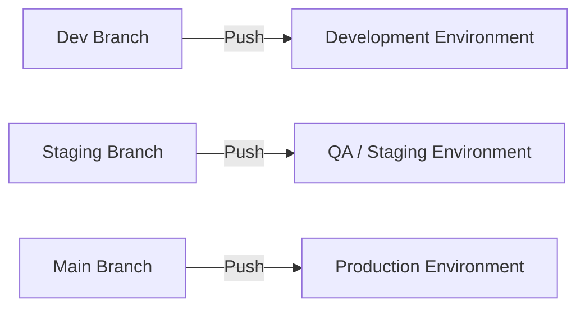

# 🧠 MSSA Cloud App Dev Notes – C#, Docker & .NET Core

*A practical introduction to compiled languages in a modern cloud workflow*

---

### 💡 Why C# Needs a Compiler:

C# is a **compiled language**, which means the code you write (called **source code**) must be **translated into a lower-level language** before the computer can run it. This is done by the **C# compiler**, which turns your `.cs` files into **Intermediate Language (IL)**. The **.NET runtime (CLR)** then translates IL into **machine code** just-in-time (JIT), when your app runs.

> ✅ This makes C# fast, secure, and great for building enterprise-scale cloud applications.

---

### 🛣️ Why Use Docker with .NET?

Docker lets you run your C#/.NET app in a **lightweight container** that works the same everywhere — on your dev machine, in Azure, or in production.

Benefits:

* 🚀 **Portability**: "Build once, run anywhere"
* 🔐 **Isolation**: Keeps dependencies clean
* 🧪 **Testability**: Run multiple versions without conflict
* 🗖 **CI/CD Ready**: Plug into GitHub Actions, Azure DevOps, etc.

---

### ⚙️ Sample Dockerfile for .NET Core App

```dockerfile
FROM mcr.microsoft.com/dotnet/aspnet:6.0 AS base
WORKDIR /app
EXPOSE 80

FROM mcr.microsoft.com/dotnet/sdk:6.0 AS build
WORKDIR /src
COPY ["MyApp/MyApp.csproj", "MyApp/"]
RUN dotnet restore "MyApp/MyApp.csproj"
COPY . .
WORKDIR "/src/MyApp"
RUN dotnet build "MyApp.csproj" -c Release -o /app/build

FROM build AS publish
RUN dotnet publish "MyApp.csproj" -c Release -o /app/publish

FROM base AS final
WORKDIR /app
COPY --from=publish /app/publish .
ENTRYPOINT ["dotnet", "MyApp.dll"]
```

---

### 🧠 Managing GitHub Environments: Dev, QA, Production

GitHub supports native **environments** for each stage of deployment:

* `development`
* `qa` / `staging`
* `production`

#### 🧩️ Features:

* Environment-specific **secrets**
* **Required reviewers** and **wait timers**
* Manual **approval gates**

#### 🛠️ How to Set It Up:

1. Go to **Repo > Settings > Environments**
2. Create an environment (e.g., `production`)
3. Add secrets like `PROD_API_KEY`, `QA_DB_PASS`
4. Reference it in your GitHub Actions YAML:

```yaml
jobs:
  deploy:
    runs-on: ubuntu-latest
    environment:
      name: production
      url: https://your-app-url.com
    steps:
      - name: Checkout
        uses: actions/checkout@v3
      - name: Deploy app
        run: ./deploy.sh
```

#### 📊 Recommended Branch Mapping

| Branch    | Environment  |
| --------- | ------------ |
| `dev`     | Development  |
| `staging` | QA / Staging |
| `main`    | Production   |

> 🎯 Pro Tip: Environments give you audit logs, rollback options, and permission control for real-world deployments.

---

### 🌐 GitHub Branch-to-Environment Deployment Map (Mermaid Diagram)



---

## 🔀 What Is a **Fork**?

### 📌 Definition:

A **fork** is a **copy of an entire repository** (including its full history) that lives under **your own GitHub account**.

### ✅ Use Case:

* Contributing to someone else’s project
* Experimenting freely without affecting the original code
* Making a private copy of a public repo

### 📂 Example:

You want to contribute to an open-source repo like `github.com/facebook/react`.

1. You **fork** it to your account:
   `github.com/yourusername/react`
2. Make changes on your version.
3. Create a **pull request** to propose changes back to the original repo.

### 🔧 Command (CLI):

> *Forks happen on GitHub, not via CLI directly*, but you can clone it after:

```bash
git clone https://github.com/yourusername/react.git
```

---

## 🌿 What Is a **Branch**?

### 📌 Definition:

A **branch** is an **independent line of development** in the same repository.

### ✅ Use Case:

* Add features without breaking `main`
* Work on bug fixes
* Isolate experiments

### 📂 Example:

You want to build a login feature:

1. On your local repo:

```bash
git checkout -b feature/login
```

2. Make changes and commit:

```bash
git add .
git commit -m "Add login UI"
```

3. Push your branch:

```bash
git push origin feature/login
```

4. Later, merge it back into `main`.

---

## 🖁 What Is a **Merge**?

### 📌 Definition:

A **merge** brings together the history and changes from one branch into another.

### ✅ Use Case:

* Finalize a feature or fix
* Combine branches for release
* Sync updates from other team members

### 📂 Example:

You want to merge `feature/login` into `main`.

1. Switch to `main`:

```bash
git checkout main
```

2. Pull in the changes:

```bash
git merge feature/login
```

3. Push:

```bash
git push origin main
```

> 🧠 GitHub also allows **pull requests** to handle merges with review and CI checks.

---

## 🔄 Summary Table

| Concept    | What It Is          | Use Case                   | Where It Lives  | Common Command               |
| ---------- | ------------------- | -------------------------- | --------------- | ---------------------------- |
| **Fork**   | Copy of entire repo | Contribute to another repo | On GitHub       | `Fork` via UI                |
| **Branch** | Line of development | Add feature, fix bug       | Inside one repo | `git checkout -b branchname` |
| **Merge**  | Combine branches    | Finalize feature, release  | Any Git repo    | `git merge branchname`       |

---

## 🧭 Visual Git Workflow: Fork → Branch → PR → Merge


---

## 📘 Summary

You're not just learning C# — you're learning how **modern cloud-native development** works with compiled languages, containers, CI/CD pipelines, GitHub environments, and Git workflows.

🧠 Git & GitHub Beginner Automation Script

This bash script demonstrates the most common Git commands in a beginner-friendly way, complete with inline notes.

#!/bin/bash

# ✅ STEP 1: Initialize a new local repo and push to GitHub
mkdir myproject && cd myproject
echo "# My MSSA Demo Project" > README.md

git init                            # Start tracking this directory with Git
git add README.md                   # Stage the README file
git commit -m "Initial commit"      # Save a snapshot of the project
git branch -M main                  # Rename default branch to 'main'
git remote add origin https://github.com/YOUR-USERNAME/mssa3demo.git
                                    # Link to your GitHub repo
git push -u origin main             # Push local repo to GitHub

# ✅ STEP 2: Simulate collaboration from two users
mkdir C:/GitHub.bob                 # Create a local directory for the clone
cd C:/GitHub.bob
git clone https://github.com/YOUR-USERNAME/mssa3demo.git
cd mssa3demo
code .                              # Open in VS Code

# ✅ STEP 3: Alice creates a conflicting change
git checkout -b alice-conflict
echo "This is Alice's version of the file." > shared.txt
git add shared.txt
git commit -m "Alice adds her version of shared.txt"
git push -u origin alice-conflict

# ✅ STEP 4: Bob creates his own conflicting change
git checkout -b bob-conflict
echo "This is Bob's version of the file." > shared.txt
git add shared.txt
git commit -m "Bob adds his version of shared.txt"
git push -u origin bob-conflict

# ✅ STEP 5: Alice merges main (expect conflict)
git fetch origin
git checkout alice-conflict
git merge origin/main               # Will trigger a conflict

# Resolve the conflict manually in shared.txt

# ✅ STEP 6: Finalize conflict resolution
git add shared.txt
git commit -m "Resolve merge conflict in shared.txt"
git push

💡 This script helps visualize branching, conflict, and collaboration workflows for new developers. Use it in demos, classes, or as part of your onboarding guide.

Great question! Here's a clear, **non-technical explanation** of the difference between an **engine** like Node.js and an **IDE** like Visual Studio or RStudio — using everyday examples:

---

### 🔧 **What is Node.js (Engine)?**

> Think of **Node.js** like a **car engine**.

It **runs the code** — specifically JavaScript code — behind the scenes. Just like a car engine turns fuel into motion, Node.js turns your code into something that can actually *do things*, like handle a website, talk to a database, or send you a notification.

#### 🧠 Everyday Example:

Imagine you wrote a recipe (your code) for making coffee.
Node.js is the **coffee machine** that reads your recipe and actually **makes the coffee**. ☕

* You don’t write your recipe *in* the coffee machine — it just executes it.
* It doesn’t care what your kitchen looks like — it just does its job.

---

### 🖥️ **What is an IDE (like VS Studio or RStudio)?**

> An **IDE** (Integrated Development Environment) is more like **your kitchen**.

It’s where you **write, organize, test, and edit** your recipe (code). It gives you:

* Measuring cups (syntax highlighting)
* Timers (debugging tools)
* Recipe books (documentation help)
* Organized counters (file management)

It’s the place where you **create and fine-tune** your recipe **before** you give it to the coffee machine (Node.js) to run.

#### 🧠 Everyday Example:

* **Visual Studio** is like a kitchen that supports many cuisines: JavaScript, C#, Python, and more.
* **RStudio** is a kitchen made specifically for **data science** and **R programming** — great for building graphs, reports, and dashboards.

---

### 🧩 So, how do they work together?

| Tool          | What it does                       | Real-world analogy                 |
| ------------- | ---------------------------------- | ---------------------------------- |
| **Node.js**   | Runs your JavaScript code (engine) | Coffee machine                     |
| **VS Studio** | Write and manage your code (IDE)   | Full-featured modern kitchen       |
| **RStudio**   | Write R code and build dashboards  | Specialized kitchen for data chefs |

---

### 🏁 Summary:

* **Node.js** is the engine that **executes** JavaScript.
* **RStudio / Visual Studio** are places where you **write and refine** the code before it runs.
* You write your code in an IDE. You run it using an engine like Node.js.

That’s an **excellent question**, and you’re not alone—this is where a lot of people get confused, especially when you’re blending **R**, **JavaScript**, and other engines in tools like RStudio.

Let’s clear it up step by step in **plain language**:

---

## 🌟 Why you can run JavaScript in RStudio **without** Node.js

✅ **Short Answer:**
You’re not actually *running* standalone JavaScript the same way Node.js does — you’re letting R **send instructions to your web browser**, and the browser’s built-in JavaScript engine runs them.

✅ **Slightly Longer Answer:**
Here’s what’s happening:

1. **RStudio** is primarily an IDE for R.
2. Packages like **htmlwidgets**, **plotly**, and **echarts4r** generate HTML + JavaScript code **inside R**.
3. When you call `e_charts()` or `plotlyOutput()`, RStudio builds an HTML file behind the scenes.
4. That HTML has:

   * Your data
   * Some JSON config
   * A `<script>` tag that loads JavaScript in your web browser
5. The **web browser** (Chrome, Firefox, etc.) actually executes the JavaScript — **not Node.js**.

In other words:

✅ You don’t need Node.js because your browser already knows how to run JavaScript.

---

### 🧠 Simple Analogy

Imagine you’re:

* **RStudio**: the chef who writes a recipe.
* **JavaScript in RStudio**: instructions you slip into the recipe (like “sprinkle cinnamon”).
* **Web Browser**: the cook who reads the recipe and follows all the instructions.

**Node.js** is like a separate robot chef that *also* knows how to read recipes but *doesn’t* need a browser kitchen. But if you already have a cook (your browser), you don’t need Node.js just to follow JavaScript steps.

---

### 🧩 How is this different from Node.js?

| What Runs It?          | What You Need It For                                                     |
| ---------------------- | ------------------------------------------------------------------------ |
| **Browser JavaScript** | Making interactive charts in RMarkdown, Shiny apps, or HTML widgets      |
| **Node.js JavaScript** | Running backend servers, APIs, and stand-alone scripts without a browser |

So:

* **Browser JavaScript** = runs in your viewer pane or browser tab
* **Node.js JavaScript** = runs on your computer/server outside the browser

---

✅ **Quick Examples:**

**No Node.js Needed:**

```r
library(echarts4r)

data.frame(x = 1:10, y = rnorm(10)) |>
  e_charts(x) |>
  e_line(y)
```

*(This makes a JavaScript chart — but your browser runs it.)*

**Needs Node.js:**

```bash
node my_server.js
```

*(This starts a web server that never touches your browser.)*

---

✅ **TL;DR:**
When you’re working in RStudio:

> You can create and *embed* JavaScript for visualization without Node.js, because RStudio hands it off to your web browser to run.

Node.js is only needed if you want to:

* Run JavaScript *without* a browser
* Build backend apps, APIs, or command-line tools

---

Great! Here's the **full explanation bundled together** — perfect for your personal notes, RPubs post, GitHub wiki, or even a tech blog article. This version now includes the **extra clarification about how JavaScript gets executed in RStudio without Node.js**, plus a bonus diagram-style summary.

---

## 🧠 What's the Difference Between Node.js and RStudio/VS Studio? (And Why Can I Run JS Without Node?)

### 🔧 Node.js = Engine

**What it is:** A runtime that *executes* JavaScript code on your local machine or server — without a browser.

**Think of it like:** A standalone coffee machine.
You feed it JavaScript instructions, and it brews up data, backend logic, or a live API server — no browser needed.

---

### 🖥️ RStudio / Visual Studio = IDE (Integrated Development Environment)

**What it is:** A place to *write, organize, and debug* code in many languages — including R, Python, C#, or JavaScript (in some cases).

**Think of it like:** A kitchen where you test recipes.
The IDE doesn't *execute* all code types itself — it just helps you **prepare** them and sometimes calls on another engine (like your browser or Node.js) to run the final steps.

---

### 🤯 So Why Can I Run JavaScript in RStudio Without Node.js?

✅ Because you're not really using Node.js — you're letting R generate **JavaScript code** that your **web browser** runs.

🧩 Here's how it works:

1. You use an R package like `echarts4r`, `plotly`, or `htmlwidgets`.
2. That package writes an **HTML file** with embedded JavaScript.
3. RStudio opens that HTML in the Viewer (or browser).
4. The **browser** (which has a JavaScript engine built-in) runs the JS code — **not Node.js**.

> 💡 So you don’t need Node.js because your browser *already knows how to execute JavaScript.*

---

### 🔁 Summary Comparison

| Tool        | Role            | Executes JS?         | Needs Node.js? | Example Use                              |
| ----------- | --------------- | -------------------- | -------------- | ---------------------------------------- |
| **Node.js** | JS engine       | ✅ Yes (server-side)  | ✅ Yes          | Backend APIs, CLI tools, file processing |
| **Browser** | Client renderer | ✅ Yes (client-side)  | ❌ No           | View charts from `echarts4r`, `plotly`   |
| **RStudio** | IDE / Editor    | ❌ No (prepares code) | ❌ No           | Write R + JS; browser runs the JS        |

---

### 📊 Real Example

```r
library(echarts4r)

df <- data.frame(x = 1:10, y = rnorm(10))

df |>
  e_charts(x) |>
  e_line(y)
```

☕ RStudio builds a web page.
🌐 Your browser reads it.
⚙️ Browser JS engine (like V8 or SpiderMonkey) runs it.
🚫 Node.js is not involved.

---

### ✅ When You *Do* Need Node.js

* Building web servers in JavaScript
* Running JS from the command line
* Automating tasks outside the browser
* Powering backend logic in tools like React, Express, etc.

---


