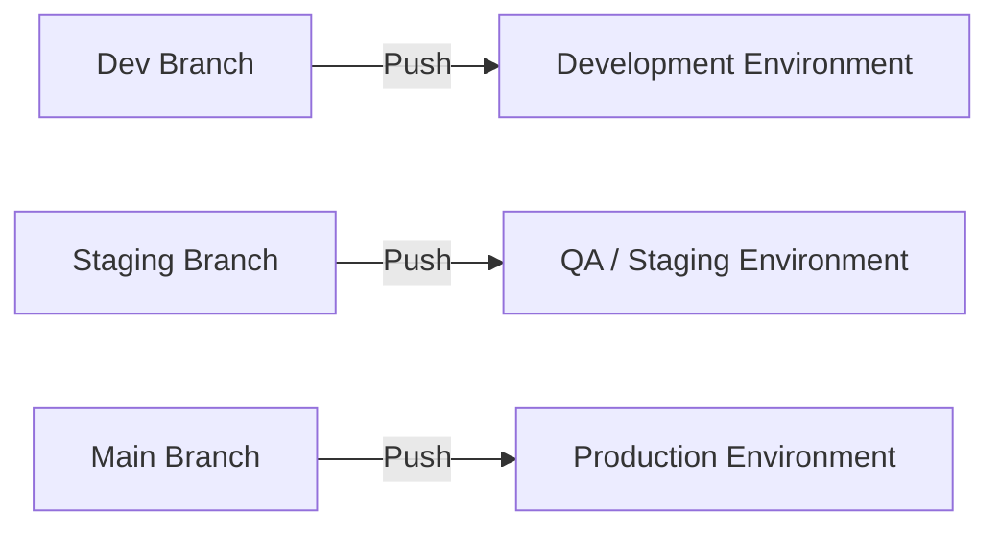

# 🧠 MSSA Cloud App Dev Notes – C#, Docker & .NET Core

*A practical introduction to compiled languages in a modern cloud workflow*

---

### 💡 Why C# Needs a Compiler:

C# is a **compiled language**, which means the code you write (called **source code**) must be **translated into a lower-level language** before the computer can run it. This is done by the **C# compiler**, which turns your `.cs` files into **Intermediate Language (IL)**. The **.NET runtime (CLR)** then translates IL into **machine code** just-in-time (JIT), when your app runs.

> ✅ This makes C# fast, secure, and great for building enterprise-scale cloud applications.

---

### 🐳 Why Use Docker with .NET?

Docker lets you run your C#/.NET app in a **lightweight container** that works the same everywhere — on your dev machine, in Azure, or in production.

Benefits:

* 🚀 **Portability**: "Build once, run anywhere"
* 🔐 **Isolation**: Keeps dependencies clean
* 🧪 **Testability**: Run multiple versions without conflict
* 📆 **CI/CD Ready**: Plug into GitHub Actions, Azure DevOps, etc.

---

### ⚙️ Sample Dockerfile for .NET Core App

```dockerfile
FROM mcr.microsoft.com/dotnet/aspnet:6.0 AS base
WORKDIR /app
EXPOSE 80

FROM mcr.microsoft.com/dotnet/sdk:6.0 AS build
WORKDIR /src
COPY ["MyApp/MyApp.csproj", "MyApp/"]
RUN dotnet restore "MyApp/MyApp.csproj"
COPY . .
WORKDIR "/src/MyApp"
RUN dotnet build "MyApp.csproj" -c Release -o /app/build

FROM build AS publish
RUN dotnet publish "MyApp.csproj" -c Release -o /app/publish

FROM base AS final
WORKDIR /app
COPY --from=publish /app/publish .
ENTRYPOINT ["dotnet", "MyApp.dll"]
```

---

### 🧠 Managing GitHub Environments: Dev, QA, Production

GitHub supports native **environments** for each stage of deployment:

* `development`
* `qa` / `staging`
* `production`

#### 🧩 Features:

* Environment-specific **secrets**
* **Required reviewers** and **wait timers**
* Manual **approval gates**

#### 🛠️ How to Set It Up:

1. Go to **Repo > Settings > Environments**
2. Create an environment (e.g., `production`)
3. Add secrets like `PROD_API_KEY`, `QA_DB_PASS`
4. Reference it in your GitHub Actions YAML:

```yaml
jobs:
  deploy:
    runs-on: ubuntu-latest
    environment:
      name: production
      url: https://your-app-url.com
    steps:
      - name: Checkout
        uses: actions/checkout@v3
      - name: Deploy app
        run: ./deploy.sh
```

#### 📊 Recommended Branch Mapping

| Branch    | Environment  |
| --------- | ------------ |
| `dev`     | Development  |
| `staging` | QA / Staging |
| `main`    | Production   |

> 🎯 Pro Tip: Environments give you audit logs, rollback options, and permission control for real-world deployments.

---

### 🌐 GitHub Branch-to-Environment Deployment Map (Mermaid Diagram)



---

## 🔀 What Is a **Fork**?

### 📌 Definition:

A **fork** is a **copy of an entire repository** (including its full history) that lives under **your own GitHub account**.

### ✅ Use Case:

* Contributing to someone else’s project
* Experimenting freely without affecting the original code
* Making a private copy of a public repo

### 📂 Example:

You want to contribute to an open-source repo like `github.com/facebook/react`.

1. You **fork** it to your account:
   `github.com/yourusername/react`
2. Make changes on your version.
3. Create a **pull request** to propose changes back to the original repo.

### 🔧 Command (CLI):

> *Forks happen on GitHub, not via CLI directly*, but you can clone it after:

```bash
git clone https://github.com/yourusername/react.git
```

---

## 🌿 What Is a **Branch**?

### 📌 Definition:

A **branch** is an **independent line of development** in the same repository.

### ✅ Use Case:

* Add features without breaking `main`
* Work on bug fixes
* Isolate experiments

### 📂 Example:

You want to build a login feature:

1. On your local repo:

```bash
git checkout -b feature/login
```

2. Make changes and commit:

```bash
git add .
git commit -m "Add login UI"
```

3. Push your branch:

```bash
git push origin feature/login
```

4. Later, merge it back into `main`.

---

## 🔁 What Is a **Merge**?

### 📌 Definition:

A **merge** brings together the history and changes from one branch into another.

### ✅ Use Case:

* Finalize a feature or fix
* Combine branches for release
* Sync updates from other team members

### 📂 Example:

You want to merge `feature/login` into `main`.

1. Switch to `main`:

```bash
git checkout main
```

2. Pull in the changes:

```bash
git merge feature/login
```

3. Push:

```bash
git push origin main
```

> 🧠 GitHub also allows **pull requests** to handle merges with review and CI checks.

---

## 🔄 Summary Table

| Concept    | What It Is          | Use Case                   | Where It Lives  | Common Command               |
| ---------- | ------------------- | -------------------------- | --------------- | ---------------------------- |
| **Fork**   | Copy of entire repo | Contribute to another repo | On GitHub       | `Fork` via UI                |
| **Branch** | Line of development | Add feature, fix bug       | Inside one repo | `git checkout -b branchname` |
| **Merge**  | Combine branches    | Finalize feature, release  | Any Git repo    | `git merge branchname`       |

---

## 🧭 Visual Git Workflow: Fork → Branch → PR → Merge

```mermaid
flowchart LR
    A[Original Repo (main)] -->|Fork| B[Your Forked Repo (main)]
    B -->|Create Branch| C[feature/login]
    C -->|Make Commits| D[Commits]
    D -->|Push to Fork| E[Pull Request]
    E -->|Merge| F[Original Repo (main)]

